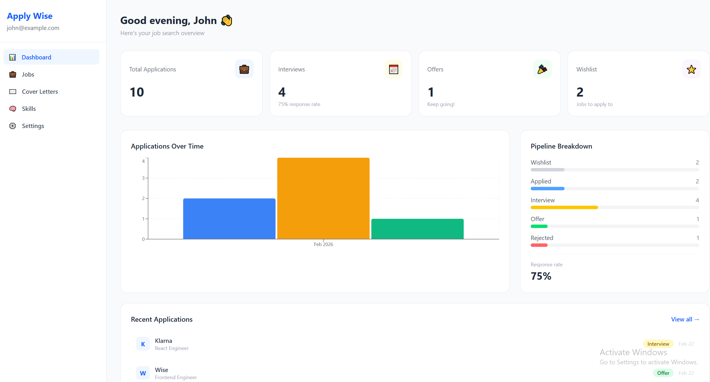
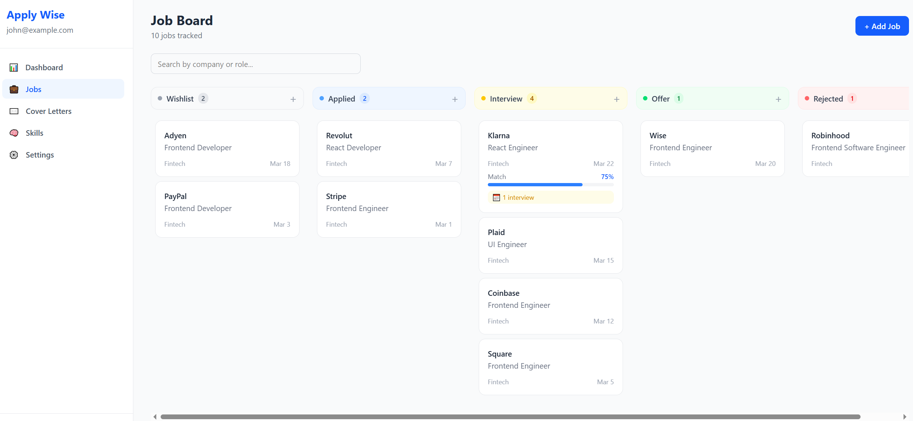
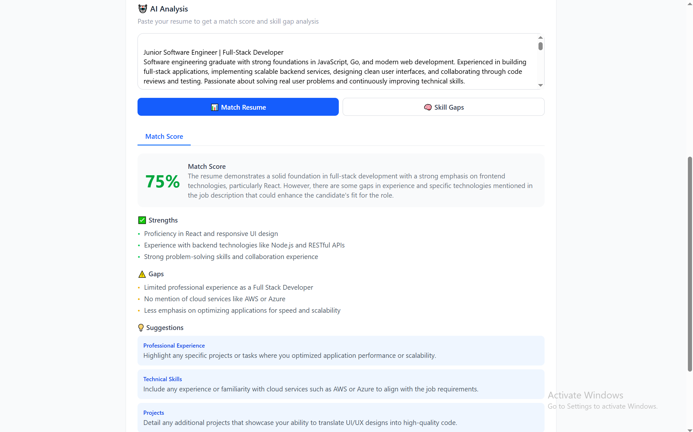
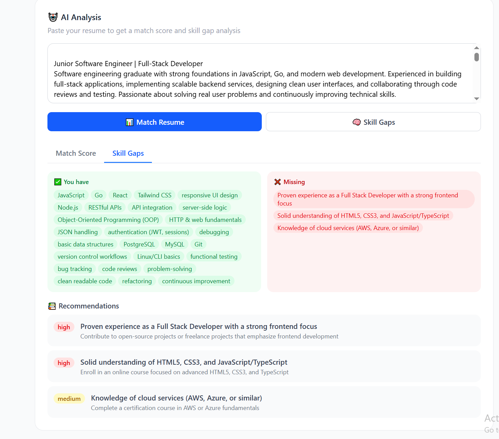
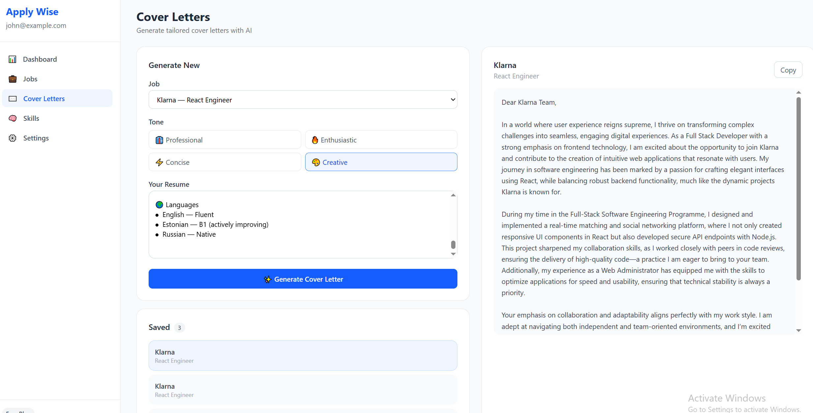

# ApplyWise 🚀

[](https://apply-wise-ruby.vercel.app)
[](https://react.dev)
[](https://nodejs.org)

**An AI-powered career platform that helps developers and professionals strategize job searches, optimize applications, and track their career growth.**


---

## ✨ Features

### 📋 Kanban Job Board
Drag and drop job applications across a visual pipeline — Wishlist → Applied → Interview → Offer → Rejected. Real-time status updates with smooth animations.

### 🤖 AI Resume Matching
Paste your resume against any job description and get an instant match score, strengths analysis, skill gap breakdown, and section-by-section improvement suggestions — powered by GPT-4o-mini.

### ✉️ AI Cover Letter Generator
Generate tailored cover letters in seconds. Choose your tone (Professional, Enthusiastic, Concise, Creative), preview instantly, copy to clipboard, and manage a library of saved letters.

### 📊 Analytics Dashboard
Visual overview of your entire job search — monthly application trends, pipeline breakdown, response rate, and recent activity.

### 📅 Interview Tracker
Log every interview round (Phone, Technical, Onsite, Final) with dates and notes. Track response times and see everything in one place.

### 🔐 Two-Factor Authentication
Optional TOTP-based 2FA via Google Authenticator or Authy. Full setup, enable, and disable flow with QR code generation.

---

## 🛠 Tech Stack

**Frontend**
- React + Vite
- Tailwind CSS
- React Query (TanStack)
- React Router v6
- @hello-pangea/dnd (drag and drop)
- Recharts
- Axios

**Backend**
- Node.js + Express
- Prisma ORM
- PostgreSQL (Supabase)
- JWT Authentication
- bcryptjs
- speakeasy (TOTP 2FA)
- OpenAI API (gpt-4o-mini)

**Infrastructure**
- Frontend: Vercel
- Backend: Railway
- Database: Supabase

---

## 📸 Screenshots

| Dashboard | Kanban Board |
|-----------|-------------|
|  |  |

| AI Resume Match | Cover Letter Generator |
|----------------|----------------------|
|  | |  | 
|  |


---

## 🚀 Getting Started

### Prerequisites
- Node.js 18+
- A [Supabase](https://supabase.com) account (free)
- An [OpenAI](https://platform.openai.com) API key

### 1. Clone the repo

```bash
git clone https://github.com/yourusername/career-craft.git
cd career-craft
```

### 2. Set up the backend

```bash
cd server
npm install
```

Create a `.env` file in the `server/` directory:

```env
PORT=5000
DATABASE_URL=your_supabase_postgresql_connection_string
JWT_SECRET=your_long_random_secret_string
OPENAI_API_KEY=sk-your_openai_api_key
```

Push the database schema:

```bash
npx prisma db push
```

Start the backend:

```bash
npm run dev
```

### 3. Set up the frontend

```bash
cd ../client
npm install
npm run dev
```

Visit `http://localhost:5173` — the app is running.

---

## 🗂 Project Structure

```
career-craft/
├── client/                   # React frontend
│   └── src/
│       ├── pages/            # Full page components
│       ├── components/       # Reusable UI components
│       ├── layouts/          # Page layouts (Auth, App)
│       ├── hooks/            # Custom React hooks
│       ├── services/         # API service functions
│       └── context/          # React context (Auth)
│
└── server/                   # Node.js backend
    ├── controllers/          # Route logic
    ├── routes/               # Express routers
    ├── middleware/            # Auth, error handling, plan guard
    └── prisma/               # Schema + Prisma client
```

---

## 🔌 API Overview

| Method | Endpoint | Description |
|--------|----------|-------------|
| POST | `/auth/register` | Register new user |
| POST | `/auth/login` | Login + JWT |
| GET | `/auth/me` | Get current user |
| POST | `/auth/2fa/setup` | Generate 2FA QR code |
| POST | `/auth/2fa/enable` | Confirm and enable 2FA |
| GET | `/jobs` | Get all jobs (filterable) |
| POST | `/jobs` | Create job |
| PATCH | `/jobs/:id` | Update job |
| DELETE | `/jobs/:id` | Delete job |
| GET | `/jobs/stats` | Job stats + counts |
| POST | `/jobs/:id/interviews` | Add interview |
| POST | `/ai/match` | AI resume match |
| POST | `/ai/cover-letter` | Generate cover letter |
| POST | `/ai/skill-gaps` | Skill gap analysis |
| GET | `/analytics/monthly` | Monthly chart data |

---

## 🔐 Environment Variables

### Server

| Variable | Description |
|----------|-------------|
| `DATABASE_URL` | PostgreSQL connection string from Supabase |
| `JWT_SECRET` | Long random string for signing tokens |
| `OPENAI_API_KEY` | Your OpenAI API key |
| `PORT` | Server port (default 5000) |

### Client

| Variable | Description |
|----------|-------------|
| `VITE_API_URL` | Backend URL (update for production) |

---

## 🏗 Architecture Decisions

**Why JWT over sessions?**
Stateless auth works well for this use case. The 7-day expiry is a known tradeoff — a production app would layer in a token blacklist for instant logout.

**Why gpt-4o-mini?**
Fast, cheap, and accurate enough for resume matching and cover letter generation. Cost per analysis is under $0.01.

**Why Prisma?**
Type-safe queries, clean schema-first migrations, and Prisma Studio for visual DB inspection during development made it the right call over raw SQL or a query builder.

**Why @hello-pangea/dnd?**
The maintained fork of react-beautiful-dnd — battle-tested API with zero breaking changes from the original.

---

## 🗺 Roadmap

- [ ] Stripe subscription tiers (Pro plan)
- [ ] File uploads — attach resume/cover letter to jobs
- [ ] Email reminders for upcoming interviews
- [ ] PDF export for cover letters and analytics
- [ ] Skill growth tracker with course recommendations
- [ ] Dark mode
- [ ] Mobile app (React Native)

---

## 👨‍💻 Author

**Nadzeya Harbuzava**
- GitHub: [@nadiaharb](https://github.com/nadiaharb/apply-wise.git)
- LinkedIn: [Nadzeya Harbuzava](www.linkedin.com/in/nadzeya-harbuzava)


---

<div align="center">
  <p>Built with ☕ and a lot of job applications</p>
  <p>
    <a href="#features">Features</a> •
    <a href="#getting-started">Getting Started</a> •
    <a href="#roadmap">Roadmap</a>
  </p>
</div>